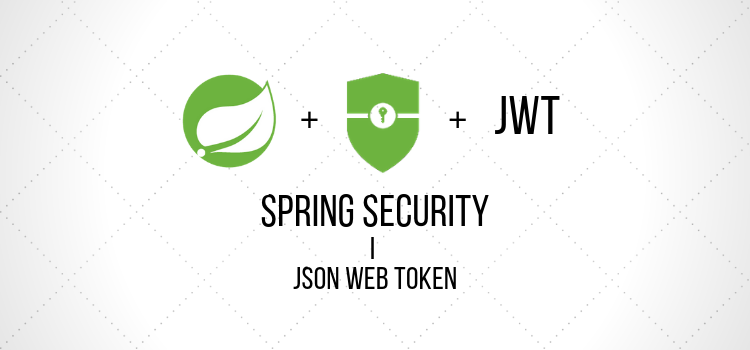
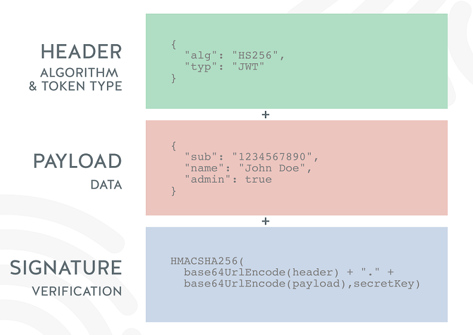
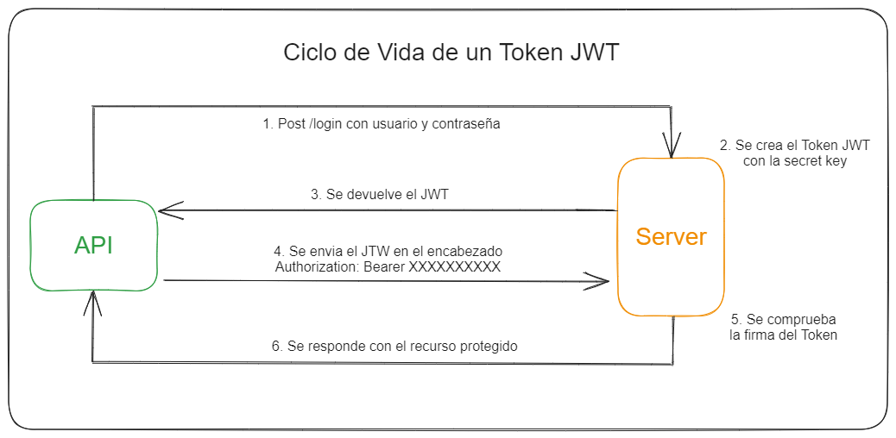

# Spring Security - JSON Web Token - Autenticación & Autorización

El objetivo de este proyecto es proporcionar un ejemplo práctico de cómo implementar autenticación y autorización en una aplicación Spring Boot utilizando JSON Web Tokens (JWT) y Spring Security. 
Este proyecto servirá como guía para desarrolladores que deseen entender y aplicar estos conceptos en sus propios proyectos.

<p align="center">
    
</p>

## Introducción

### Autenticación vs Autorización

| Autenticación                                                                                          | Autorización                                                                                                                                                     |
|--------------------------------------------------------------------------------------------------------|------------------------------------------------------------------------------------------------------------------------------------------------------------------|
| Determinar que un usuario es quien dice ser, el usuario provee credenciales para validar su identidad. | Determinar si un usuario puede o no acceder a un recurso, el usuario tiene asociados roles o existen reglas que determinaran si se puede o no accederal recurso. |

### JSON Web Token

Es un standard abierto que define una forma compacta y autónoma de transmitir  información de manera segura entre partes como un objeto JSON. 
De nuevo, JWT es un estándar, lo que significa que todos los JWT son tokens, pero no todos los tokens son JWT.

Debido a su tamaño relativamente pequeño, un JWT se puede enviar a través de una URL, mediante un parámetro POST o dentro de un encabezado HTTP, y se transmite rápidamente. 
Contiene toda la información requerida sobre una entidad para evitar consultar una base de datos más de una vez. 
El receptor de un JWT tampoco necesita llamar a un servidor para validar el token.

<div style="display: flex; justify-content: center;">
    
    
</div>

### Spring Security

Spring Security es una librería que forma parte del paraguas del proyecto Spring. Spring tiene más de 25 sub proyectos o módulos que aportan funcionalidad que las aplicaciones pueden utilizar si lo creen conveniente. 
En este caso Spring Security trata de agrupar todas las funcionalidades de **control de acceso de usuarios** sobre proyectos Spring.

El control de acceso permite limitar las opciones que pueden ejecutar un determinado conjunto de usuarios o roles sobre la aplicación. 
En esta dirección, Spring Security controla las invocaciones a la lógica de negocios o **limita el acceso de peticiones HTTP** a determinadas URLs.

En definitiva, **Spring Security es el método más conveniente para incorporar una capa de seguridad** en donde se desea que sólo algunos usuarios tengan acceso a métodos y controladores de una aplicación Spring en base al uso de roles de usuario.

## Dependencias

Este proyecto utiliza la biblioteca [jjwt](https://github.com/jwtk/jjwt) para manejar los tokens JWT.

### Maven

Agrega las siguientes dependencias al archivo `pom.xml`:

````xml
<dependency>
    <groupId>io.jsonwebtoken</groupId>
    <artifactId>jjwt-api</artifactId>
    <version>0.12.5</version>
</dependency>
<dependency>
    <groupId>io.jsonwebtoken</groupId>
    <artifactId>jjwt-impl</artifactId>
    <version>0.12.5</version>
    <scope>runtime</scope>
</dependency>
<dependency>
    <groupId>io.jsonwebtoken</groupId>
    <artifactId>jjwt-jackson</artifactId> <!-- or jjwt-gson if Gson is preferred -->
    <version>0.12.5</version>
    <scope>runtime</scope>
</dependency>
````

### Gradle

Agrega las siguientes dependencias al archivo `build.gradle`:

````gradle
implementation 'io.jsonwebtoken:jjwt-api:0.12.5'
runtimeOnly 'io.jsonwebtoken:jjwt-impl:0.12.5'
runtimeOnly 'io.jsonwebtoken:jjwt-jackson:0.12.5'
````

## API de Postman

Puedes encontrar la colección de la API de este proyecto en [JWT Spring Security API](https://www.postman.com/crimson-space-910033/workspace/jwt-spring-security). Esta colección contiene todas las solicitudes necesarias para probar la API.